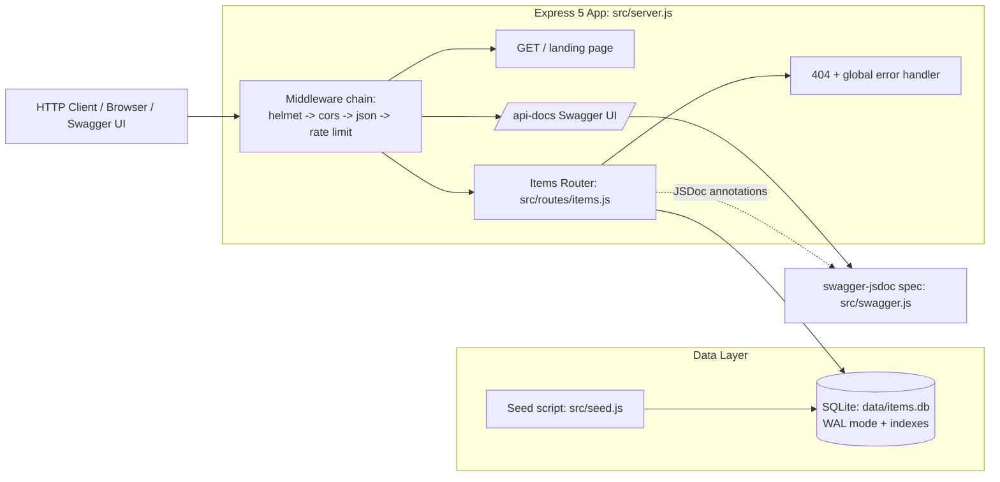

# Pagination & Search API — Step-by-Step Build Guide

> **Archived: original build playbook.** This document is the original roadmap used to build the Pagination & Search API from an empty folder to a deployable service. The codebase may have evolved since this guide was written — for the current setup, architecture, and deployment notes, always defer to [../README.md](../README.md). Treat the steps below as a making-of narrative rather than a live specification.

---

> **Project Summary:** A modern RESTful API built with Express 5 and SQLite that demonstrates production-grade server-side pagination, SQL-powered search, category filtering, and flexible sorting over a product catalog. It exposes full CRUD (`GET`/`POST`/`PUT`/`PATCH`/`DELETE`) on an `items` resource, returns rich pagination metadata (`totalItems`, `totalPages`, `hasNextPage`, `hasPrevPage`), and ships interactive OpenAPI 3.0 documentation via Swagger UI. Security is layered through `helmet` HTTP headers, per-IP rate limiting, strict request-body validation, and a search-length cap. The embedded `better-sqlite3` database runs in WAL mode with indexed columns and auto-seeds 500 sample items on first run. The service is single-process, zero-config, and deployable to Render with one `render.yaml`.

`Each step below is a self-contained prompt. Execute them in order.`

`Stack: Node.js 22.x · Express 5 · better-sqlite3 (SQLite) · swagger-jsdoc · swagger-ui-express · helmet · express-rate-limit · cors`

---

## Table of Contents

**PHASE 1 — Backend Foundation**

- STEP 1 — Project Scaffolding & Dependency Setup
- STEP 2 — SQLite Connection, Schema & Indexes
- STEP 3 — Database Seeding Script

**PHASE 2 — Backend Resources**

- STEP 4 — Items Router & Input Validation
- STEP 5 — Pagination, Search, Filter & Sort (GET /items)
- STEP 6 — Single-Item & Categories Endpoints
- STEP 7 — Create, Replace, Partial-Update & Delete (POST/PUT/PATCH/DELETE)

**PHASE 3 — API Surface & Documentation**

- STEP 8 — Swagger / OpenAPI Configuration
- STEP 9 — Express App Assembly & Landing Page

**PHASE 4 — Security & Hardening**

- STEP 10 — Helmet, CORS & Rate Limiting
- STEP 11 — Error Handling & Validation Hardening

**PHASE 5 — Polish & Deploy**

- STEP 12 — Auto-Seed Bootstrap & Server Startup
- STEP 13 — Render Deployment Configuration
- STEP 14 — Documentation & Community Health Files

**Appendices**

- Appendix A — Shared Constants
- Appendix B — Response Contract Patterns
- Appendix C — Common Pitfalls
- Appendix D — Pre-Flight Checklist

---

## Global Build Rules (apply to EVERY step)

- **No git operations.** Do not run `git` commands, do not commit, do not push, and do not create branches or tags. Version control is handled manually by the user.
- Do not install unapproved packages. Only add a dependency when a step explicitly calls for it.
- Do not run long-running processes (servers, watchers) unless the step or the user requests it; prefer short verification commands.
- Treat every step as self-contained: read the listed files, make the listed edits, and confirm the acceptance checklist before moving on.
- Keep code modern and consistent with existing local patterns: CommonJS modules, ES6+ syntax, `camelCase` identifiers, descriptive English names.
- Prioritize security, validation, performance, and deployment readiness in every change.
- Prefer native methods and the existing dependency set over new libraries.

---

## Architecture at a Glance



The service is a single Node.js process. Express handles routing and middleware; `better-sqlite3` provides synchronous, file-backed persistence under `data/`; `swagger-jsdoc` reads JSDoc annotations from the router to build the OpenAPI spec served by `swagger-ui-express`. There is no separate client framework — the root route returns a self-contained HTML landing page. On startup the app auto-seeds the database if it is empty.

---

# PHASE 1 — BACKEND FOUNDATION

---

## STEP 1 — Project Scaffolding & Dependency Setup

**Goal:** Establish the Node.js project, scripts, runtime pin, and dependency set.

**Files/folders to create or edit:**

- `package.json`
- `.gitignore`
- `src/` (directory)

**Required dependencies:**

```bash
npm install better-sqlite3 cors express express-rate-limit helmet swagger-jsdoc swagger-ui-express
```

**Implementation notes:**

- Set `"type": "commonjs"` and `"main": "src/server.js"`.
- Pin the runtime with `"engines": { "node": "22.x" }` so local and Render builds match.
- Define scripts:
  - `start`: `node src/server.js`
  - `seed`: `node src/seed.js`
  - `dev`: `node --watch src/server.js` (uses Node's built-in watcher, no nodemon dependency)
- `.gitignore` must exclude `node_modules/`, `data/`, `.env`, and `*.db` so the generated database and secrets never get committed.

**Acceptance checklist:**

- [ ] `npm install` completes without errors.
- [ ] `package.json` lists all seven runtime dependencies.
- [ ] `npm start`/`npm run seed`/`npm run dev` scripts exist.
- [ ] `data/` and `node_modules/` are git-ignored.

---

## STEP 2 — SQLite Connection, Schema & Indexes

**Goal:** Provide a single, reusable database accessor that lazily opens the connection, ensures the schema, and creates indexes.

**Files/folders to create or edit:**

- `src/database.js`

**Implementation notes:**

- Resolve the database path to `data/items.db` relative to the project root (`path.join(__dirname, "..", "data", "items.db")`).
- Use a lazy singleton: a module-level `db` variable initialized on first `getDatabase()` call, so the connection is shared across the app and seed script.
- Create the `data/` directory with `fs.mkdirSync(..., { recursive: true })` if it does not exist, to avoid a "no such file or directory" error on a fresh checkout.
- Enable `journal_mode = WAL` for better read/write concurrency and `foreign_keys = ON`.
- Create the table with `CREATE TABLE IF NOT EXISTS` and add `CREATE INDEX IF NOT EXISTS` on `name`, `category`, and `price` to keep search, filter, and sort queries fast.
- Export `{ getDatabase }`.

**Schema:**

```sql
CREATE TABLE IF NOT EXISTS items (
  id          INTEGER PRIMARY KEY AUTOINCREMENT,
  name        TEXT    NOT NULL,
  category    TEXT    NOT NULL,
  price       REAL    NOT NULL,
  description TEXT
);
```

**Performance expectation:** Indexed columns keep `WHERE category = ?` and `ORDER BY price` operations off full-table scans even as the row count grows.

**Acceptance checklist:**

- [ ] `getDatabase()` returns the same instance on repeated calls.
- [ ] The `data/` directory and `items.db` file are created automatically.
- [ ] Table and three indexes exist after first call.

---

## STEP 3 — Database Seeding Script

**Goal:** Populate the database with realistic sample data for demos and testing.

**Files/folders to create or edit:**

- `src/seed.js`

**Implementation notes:**

- Define `CATEGORIES`, `ADJECTIVES`, and `NOUNS` arrays and compose item names like `"Premium Widget 1"` with matching descriptions.
- Use helper functions `randomPick(arr)` and `randomPrice()` (price in a sensible range, rounded to 2 decimals).
- Generate `TOTAL_ITEMS = 500` items (documented as a single tunable constant).
- Wrap inserts in a `db.transaction(...)` for fast bulk insertion using a single prepared statement.
- If the table already has rows, clear them first so re-seeding is idempotent.
- Export `{ seed }` and guard direct execution with `if (require.main === module) { seed(); }` so the file works both as `npm run seed` and as an importable module (used by auto-seed in STEP 12).

**Acceptance checklist:**

- [ ] `npm run seed` inserts 500 rows and logs the count.
- [ ] Re-running clears and re-seeds without duplicating beyond 500.
- [ ] `seed` is exported for reuse.

---

# PHASE 2 — BACKEND RESOURCES

---

## STEP 4 — Items Router & Input Validation

**Goal:** Create the router module and a single reusable validation function for write operations.

**Files/folders to create or edit:**

- `src/routes/items.js`

**Implementation notes:**

- Create an Express `Router` and define the tunable constants at the top: `DEFAULT_LIMIT = 10`, `MAX_LIMIT = 100`, `MAX_SEARCH_LENGTH = 100`, `ALLOWED_SORT_FIELDS = ["name", "price", "category", "id"]`.
- Implement `validateItemInput(body, isPartial = false)` returning an array of error strings:
  - `name`: required, non-empty string, max 200 chars.
  - `category`: required, non-empty string.
  - `price`: required, positive number.
  - `description`: optional, must be a string if present.
  - When `isPartial` is `true`, only validate fields that are actually present (this enables `PATCH` in STEP 7).
- Export the router with `module.exports = router`.

**Acceptance checklist:**

- [ ] Router module loads without error.
- [ ] `validateItemInput` enforces all four field rules.
- [ ] Partial mode skips absent fields.

---

## STEP 5 — Pagination, Search, Filter & Sort (GET /items)

**Goal:** Implement the core list endpoint with server-side pagination, SQL search, category filter, and sorting.

**Files/folders to create or edit:**

- `src/routes/items.js`

**Implementation notes:**

- Parse and clamp query params defensively:
  - `page = Math.max(1, parseInt(req.query.page, 10) || 1)`
  - `limit = Math.min(MAX_LIMIT, Math.max(1, parseInt(req.query.limit, 10) || DEFAULT_LIMIT))`
  - `skip = (page - 1) * limit`
- Validate the sort field against `ALLOWED_SORT_FIELDS` (whitelist) and map `order` to `"ASC"`/`"DESC"`. **This is critical:** `ORDER BY` columns cannot be bound as parameters, so a whitelist is the only safe approach.
- Build a `WHERE` clause dynamically from optional conditions, pushing bound values into a `params` array:
  - Search: `(name LIKE ? COLLATE NOCASE OR description LIKE ? COLLATE NOCASE)` with a `%term%` pattern.
  - Category: `category = ?`.
- Reject search terms longer than `MAX_SEARCH_LENGTH` with `400`.
- Run a `COUNT(*)` query with the same `WHERE` clause to compute `totalItems` and `totalPages = Math.ceil(totalItems / limit)`.
- Run the paged query with `LIMIT ? OFFSET ?` appended after the filter params.
- Return the standard paginated contract (see Appendix B).

**Security expectation:** All user-provided values are bound via prepared-statement parameters; the only interpolated SQL fragments are the whitelisted sort field and direction.

**Acceptance checklist:**

- [ ] `GET /items` returns paginated data with full `pagination` metadata.
- [ ] `search`, `category`, `sort`, and `order` work individually and combined.
- [ ] Over-long search terms return `400`.
- [ ] No raw user input is concatenated into SQL.

---

## STEP 6 — Single-Item & Categories Endpoints

**Goal:** Add read endpoints for a single item and the distinct category list.

**Files/folders to create or edit:**

- `src/routes/items.js`

**Implementation notes:**

- `GET /items/categories/list`: `SELECT DISTINCT category FROM items ORDER BY category`, mapped to a string array. Define this route **before** `GET /:id` so `categories` is not captured as an `:id` param.
- `GET /items/:id`: parse the id with `parseInt`, return `400` on `NaN`, `404` when not found, otherwise `{ success: true, data: item }`.

**Acceptance checklist:**

- [ ] `GET /items/categories/list` returns a sorted unique array.
- [ ] `GET /items/:id` returns `400`/`404`/`200` correctly.
- [ ] Route ordering prevents `categories` colliding with `:id`.

---

## STEP 7 — Create, Replace, Partial-Update & Delete

**Goal:** Complete CRUD with `POST`, `PUT`, `PATCH`, and `DELETE`.

**Files/folders to create or edit:**

- `src/routes/items.js`

**Implementation notes:**

- `POST /items`: validate full body, insert, return `201` with the created row (read back via `lastInsertRowid`). Trim strings; coerce empty description to `null`.
- `PUT /items/:id`: validate id, ensure the row exists (`404` if not), validate the full body, then `UPDATE` all columns (full replacement semantics).
- `PATCH /items/:id`: validate id, ensure the row exists, require at least one of the allowed fields, validate with `isPartial = true`, then build a dynamic `SET` clause from only the provided fields using bound parameters. Normalize values (trim strings, `null` for empty description, pass price through).
- `DELETE /items/:id`: validate id, ensure existence, delete, return a success message.
- Reuse `validateItemInput` everywhere to stay DRY.

**Security expectation:** The dynamic `PATCH` `SET` clause is assembled only from a fixed `allowedFields` whitelist; values are always bound, never interpolated.

**Acceptance checklist:**

- [ ] `POST` returns `201` and the created item; invalid bodies return `400`.
- [ ] `PUT` fully replaces and returns the item; missing id returns `404`.
- [ ] `PATCH` updates only supplied fields; empty body returns `400`.
- [ ] `DELETE` removes the row and returns a confirmation.

---

# PHASE 3 — API SURFACE & DOCUMENTATION

---

## STEP 8 — Swagger / OpenAPI Configuration

**Goal:** Generate interactive OpenAPI 3.0 docs from route annotations.

**Files/folders to create or edit:**

- `src/swagger.js`
- JSDoc `@swagger` blocks in `src/routes/items.js`

**Implementation notes:**

- Configure `swagger-jsdoc` with `openapi: "3.0.0"`, project `info`, and a `servers` entry that prefers `process.env.RENDER_EXTERNAL_URL` and falls back to `http://localhost:3000`.
- Define reusable `components.schemas`: `Item`, `ItemInput`, `PaginatedResponse`, `ErrorResponse`.
- Point `apis` at `./src/routes/*.js` so JSDoc annotations are picked up.
- Annotate each route in `items.js` with `@swagger` blocks (parameters, request bodies, responses) including the `PATCH` endpoint.
- Export `{ swaggerSpec }`.

**Acceptance checklist:**

- [ ] `swaggerSpec` builds without throwing.
- [ ] All endpoints (including `PATCH`) appear in the spec.
- [ ] Server URL adapts to the Render environment.

---

## STEP 9 — Express App Assembly & Landing Page

**Goal:** Wire the app together and serve a self-contained HTML landing page at `/`.

**Files/folders to create or edit:**

- `src/server.js`

**Implementation notes:**

- Create the Express app, read `PORT` from `process.env.PORT || 3000`.
- Mount Swagger UI at `/api-docs` via `swaggerUi.serve` + `swaggerUi.setup(swaggerSpec)`.
- Serve an inline, dependency-free HTML page at `GET /` with links to the docs, a sample item listing, and the categories endpoint. Keep styling self-contained (no external assets) and accessible (semantic markup, sufficient contrast, `rel="noopener noreferrer"` on external links).
- Mount the items router at `/items`.

**Accessibility expectation:** The landing page uses semantic elements, a single `h1`, readable color contrast, and keyboard-focusable links.

**Acceptance checklist:**

- [ ] `GET /` returns the styled landing page.
- [ ] `/api-docs` serves Swagger UI.
- [ ] `/items` routes resolve to the router.

---

# PHASE 4 — SECURITY & HARDENING

---

## STEP 10 — Helmet, CORS & Rate Limiting

**Goal:** Add baseline HTTP security headers, cross-origin support, and abuse protection.

**Files/folders to create or edit:**

- `src/server.js`

**Implementation notes:**

- `app.use(helmet({ contentSecurityPolicy: false }))` — CSP is disabled so Swagger UI's inline assets render; all other protective headers stay on.
- `app.use(cors())` to allow cross-origin API consumption.
- `app.use(express.json())` for JSON body parsing.
- Configure `express-rate-limit`: `windowMs: 15 * 60 * 1000`, `max: 200`, `standardHeaders: true`, `legacyHeaders: false`, with a JSON error message, and apply it specifically to `/items`.

**Security expectation:** Responses include `RateLimit-*` headers; clients exceeding 200 requests per 15 minutes per IP receive a structured `429`-style error payload.

**Acceptance checklist:**

- [ ] Security headers are present on responses.
- [ ] Rate limit headers appear on `/items` responses.
- [ ] CORS preflight succeeds.

---

## STEP 11 — Error Handling & Validation Hardening

**Goal:** Provide consistent `404` and `500` handling and ensure all write paths are validated.

**Files/folders to create or edit:**

- `src/server.js`
- `src/routes/items.js`

**Implementation notes:**

- Add a catch-all `app.use((_req, res) => res.status(404).json({ success: false, error: "Route not found" }))` after all routes.
- Add a 4-arg global error handler that logs the error and returns `{ success: false, error: "Internal server error" }` with `500`.
- Confirm every `POST`/`PUT`/`PATCH` runs through `validateItemInput` and that id-based routes guard against `NaN`.

**Acceptance checklist:**

- [ ] Unknown routes return a structured `404`.
- [ ] Thrown errors return a structured `500` and are logged.
- [ ] All write endpoints validate input.

---

# PHASE 5 — POLISH & DEPLOY

---

## STEP 12 — Auto-Seed Bootstrap & Server Startup

**Goal:** Seed automatically on first boot and start the HTTP listener with accurate logging.

**Files/folders to create or edit:**

- `src/server.js`

**Implementation notes:**

- On startup, open the database and read the row count.
- If the count is `0`, log a message and call the imported `seed()` from `src/seed.js`.
- Re-read the count **after** seeding so the startup log reflects the true number of items (avoid logging a stale pre-seed count of `0`).
- Call `app.listen(PORT, ...)` and log the server URL, the Swagger URL, and the item count.

**Acceptance checklist:**

- [ ] A fresh database auto-seeds on first run.
- [ ] The startup log shows the correct post-seed item count.
- [ ] The server listens on the configured port.

---

## STEP 13 — Render Deployment Configuration

**Goal:** Enable one-click deployment to Render.

**Files/folders to create or edit:**

- `render.yaml`

**Implementation notes:**

- Define a `web` service with `runtime: node`.
- `buildCommand: npm install && npm run seed`
- `startCommand: npm start`
- Set env vars: `NODE_ENV=production` and a pinned `NODE_VERSION` matching `package.json` engines.
- Note: the SQLite file lives on ephemeral disk and is git-ignored; the build-time seed makes this a demo-friendly, stateless deployment. If durable user data is ever required, attach a Render persistent disk and move seeding out of the build step.

**Acceptance checklist:**

- [ ] `render.yaml` defines build and start commands.
- [ ] Node version matches the project engines pin.
- [ ] Deployment notes capture the ephemeral-data trade-off.

---

## STEP 14 — Documentation & Community Health Files

**Goal:** Ship complete project documentation and GitHub community health files.

**Files/folders to create or edit:**

- `README.md`
- `.github/CODE_OF_CONDUCT.md`
- `.github/CONTRIBUTING.md`
- `.github/SECURITY.md`
- `.github/PULL_REQUEST_TEMPLATE.md`
- `.github/ISSUE_TEMPLATE/bug_report.yml`
- `.github/ISSUE_TEMPLATE/feature_request.yml`
- `.github/ISSUE_TEMPLATE/config.yml`
- `LICENSE`

**Implementation notes:**

- Write a comprehensive `README.md`: features, live demo, technologies, installation, usage, endpoint table, query-parameter reference, response structure, schema, security notes, project structure, customization, deployment, contributing, license, and contact.
- Keep documentation in sync with the implementation — endpoint list, default values, and the search mechanism (SQL `LIKE`, not regex) must match the code.
- Place community health files under `.github/` so GitHub auto-detects them; keep `LICENSE` (MIT) at the repository root.

**Acceptance checklist:**

- [ ] `README.md` documents every endpoint, including `PATCH`.
- [ ] Default values in docs match the router constants.
- [ ] Community health files live under `.github/`.
- [ ] `LICENSE` is present at the root.

---

# Appendix A — Shared Constants

Defined at the top of `src/routes/items.js`:

```javascript
const DEFAULT_LIMIT = 10;       // Default items per page
const MAX_LIMIT = 100;          // Maximum items per page
const MAX_SEARCH_LENGTH = 100;  // Max search term length
const ALLOWED_SORT_FIELDS = ["name", "price", "category", "id"];
```

Seeding constant in `src/seed.js`:

```javascript
const TOTAL_ITEMS = 500;        // Number of sample items generated
```

Rate-limit configuration in `src/server.js`:

```javascript
windowMs: 15 * 60 * 1000;       // 15-minute window
max: 200;                       // Requests per IP per window
```

---

# Appendix B — Response Contract Patterns

Every response follows a consistent envelope.

**Success (list):**

```json
{
  "success": true,
  "data": [],
  "pagination": {
    "totalItems": 500,
    "totalPages": 50,
    "currentPage": 1,
    "limit": 10,
    "skip": 0,
    "hasNextPage": true,
    "hasPrevPage": false
  },
  "search": null
}
```

**Success (single):**

```json
{ "success": true, "data": {} }
```

**Error:**

```json
{ "success": false, "error": "Human-readable message" }
```

Rules:

- Always include a boolean `success`.
- Use `data` for payloads, `error` for failure messages, and `pagination`/`search` only on the list endpoint.
- Validation errors join individual messages with `"; "`.

---

# Appendix C — Common Pitfalls

- **Interpolating sort fields into SQL.** `ORDER BY` cannot be parameter-bound; never concatenate `req.query.sort` directly — always validate against `ALLOWED_SORT_FIELDS`.
- **Route ordering.** Declare `/items/categories/list` before `/items/:id`, or the literal path is swallowed by the dynamic param.
- **Stale startup count.** Read the item count again after auto-seeding; otherwise the log reports `0`.
- **Missing `data/` directory.** A fresh clone has no `data/`; create it before opening the database.
- **Docs drift.** Keep `package.json` description, Swagger description, and README aligned with the actual SQL `LIKE` search and the real default constants.
- **Description-based search surprises.** Seeded descriptions embed the category name, so `search` can match more rows than expected.

---

# Appendix D — Pre-Flight Checklist

Before considering the build complete:

- [ ] `npm install` succeeds on a clean checkout.
- [ ] `npm run seed` populates 500 items.
- [ ] `npm start` boots, auto-seeds when empty, and logs the correct count.
- [ ] `GET /` renders the landing page; `/api-docs` serves Swagger UI.
- [ ] `GET /items` paginates, searches, filters, and sorts correctly.
- [ ] `GET /items/:id`, `categories/list`, `POST`, `PUT`, `PATCH`, `DELETE` all behave per contract.
- [ ] Invalid input and unknown routes return structured errors.
- [ ] Security headers and rate-limit headers are present.
- [ ] `render.yaml` build/start commands are valid and the Node version matches.
- [ ] Documentation and `.github/` community files are present and accurate.
